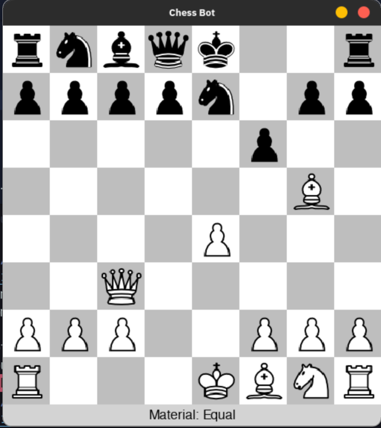
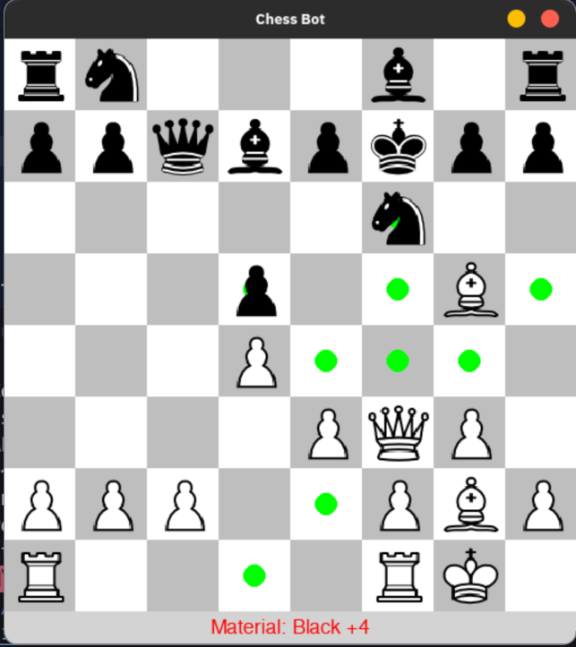
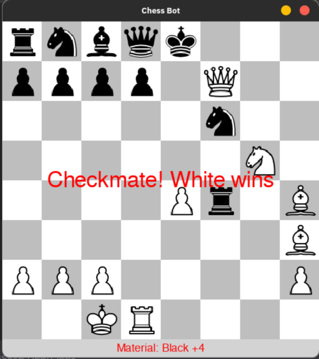

# ♟️ Chessify: Python Chess Bot with GUI and Opening Book

A beginner-friendly Chess Bot built with **Python**, **Pygame**, and **python-chess**, featuring a clean graphical interface, a Minimax-based AI opponent, and integrated **opening theory** using a Polyglot opening book.

---

## 🚀 Features

- ✔️ Fully playable chess game with GUI (Pygame)
- 🤖 AI opponent powered by Minimax with depth control
- 📘 Opening moves played using a real chess opening book (Polyglot format)
- 🎯 Legal move highlighting
- ⚖️ Material balance display (with color-coded advantage)
- ♟️ Animated piece movement
- ⏱️ Bot move delay for realism
- 🏁 Endgame detection (checkmate, stalemate, etc.)

---

## 🖼️ Screenshots

<div align="center">
  <table>
    <tr>
      <td align="center">
        
        <br>
        <em>Main Gameplay</em>
      </td>
      <td align="center">
        
        <br>
        <em>Legal Move Highlighting</em>
      </td>
      <td align="center">
        
        <br>
        <em>Endgame Detection</em>
      </td>
    </tr>
  </table>
</div>

---

## 📁 Project Structure
```bash
Chessify/  
  ├── assets/
  │   ├── images/  # Piece images (K.png, p.png, etc.)
  │   ├── screenshots/  # Gameplay GUI screenshots
  │   └── opennings.pgn  # Opening book in PGN format  

  ├── bot/ 
  │   ├── evaluation.py  # Evaluation logic
  │   ├── minimax.py  # Minimax algorithm 
  │   └── opening_book.py  # Opening book interface  

  ├── main.py  # CLI logic code
  ├── gui_chess.py  # Main GUI and game logic
  └── README.md

```


---

## 🔧 Installation

### 1. Clone the Repository
```bash
git clone https://github.com/AmanVerma1067/Chessify.git
cd Chessify
```
### 2. Install Dependencies
```bash
pip install pygame python-chess
```
### 3. Run the Chess Bot
```bash
python gui_chess.py
```
## 📦 Dependencies
- pygame

- python-chess

## 🧠 How the Bot Works
#### Opening Phase (first ~10 moves):

- Selects moves from the Polyglot opening book

#### Middle/End Game:

- Uses Minimax algorithm with alpha-beta pruning

- Evaluates positions using material and positional heuristics

#### Game Flow:

- You play as White

- Bot responds as Black automatically

- Visual indicators for check, checkmate, and draws

## 🎮 Controls
**Left-click:** Select/move pieces

Game ends automatically with appropriate messages

**Restart:** Close and relaunch the application

## 🤝 Contributing
Contributions are welcome! Submit a pull request or open an issue for bugs, improvements, or new features
